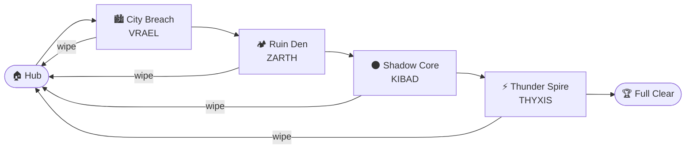
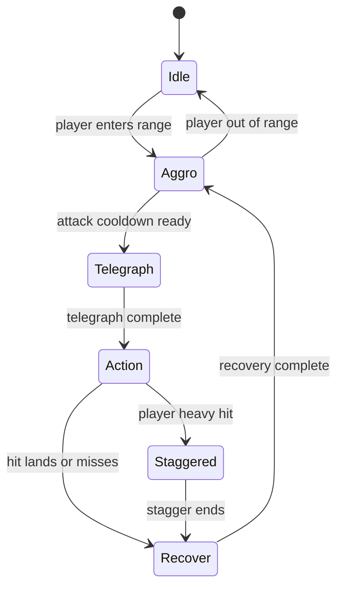
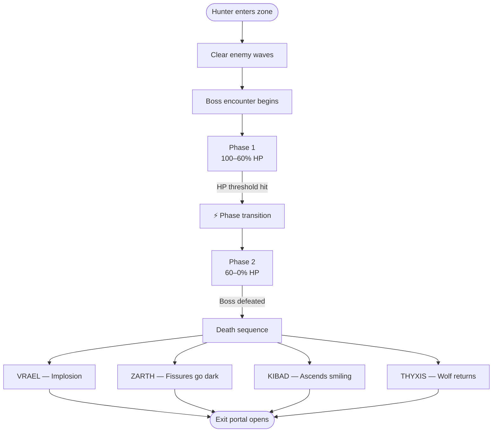

<div align="center">


# HUNTIX

### *Hunt. Enter. Survive.*

> A browser-based **2.5D** action beat 'em up built in **Three.js** for **Vibe Jam 2026**
> 1–4 hunters · Elemental gates · No login · Instant play

[](https://vibej.am/2026/)
[](https://threejs.org/)
[](#)
[](#)
[](#)

</div>

---

## 🎮 Overview

Gates have opened. Elite hunters are the only answer.

**Huntix** is a fast, polished **2.5D** brawler where 1–4 players control S-Rank hunters through portal-linked combat zones. Built in Three.js with **2D billboard sprites** in a **3D parallax world** rendered through a fixed orthographic camera — the visual clarity of 2D characters with the depth and atmosphere of a 3D environment. Inspired by **Solo Leveling** (dark fantasy escalation), **Castle Crashers** (co-op chaos, readable characters), and **Dead Cells** (tight dodge timing, status synergies).

| Detail | Info |
|--------|------|
| 🔧 Engine | Three.js (browser-native, no install) |
| 🎥 Camera | Fixed orthographic — 2.5D lane-based brawler |
| 👥 Players | 1–4 local co-op (AI fills empty slots) |
| ⏱ Session | 10–20 min full run · 2–5 min per zone |
| 🔁 Run Type | Roguelite — Essence drops, run-tied levelling |
| 🚀 Deployment | Single domain · No login · No loading screens |
| 🏆 Jam Widget | Required ✅ |

```html
<script async src="https://vibej.am/2026/widget.js"></script>
```

---

## 🔄 Core Loop

```
Hub (select hunter + weapon + shop)
  → Enter portal
    → Clear waves + boss
      → Earn Essence + XP
        → Return to Hub
          → Buy / level up
            → Push next zone  ↺
```

> Full clear = 4 zones · Wipe = lose run buffs/XP, keep 50% Essence · Win = high score + Essence bonus

---

## 🛡️ Meet the Hunters

Four S-Rank hunters. Different worlds. One purpose — when the gates open, they enter.

| [](docs/hunters/VESOL.md) | [](docs/hunters/DABIK.md) | [](docs/hunters/BENZU.md) | [](docs/hunters/SEREISA.md) |
|:---:|:---:|:---:|:---:|
| *"The gate burns."* | *"Silence is the last thing you hear."* | *"I don't dodge."* | *"You blinked."* |
| Flame · Burn | Shadow · Bleed | Thunder/Earth · Stun | Lightning · Slow |
| HP 90 · Mana 130 | HP 80 · Mana 120 | HP 160 · Mana 70 | HP 100 · Mana 100 |
| Wrist Crystal Focus | Twin Curved Daggers | Stone Gauntlets | Twin Electro-Blades |
| [→ Full Sheet](docs/hunters/VESOL.md) | [→ Full Sheet](docs/hunters/DABIK.md) | [→ Full Sheet](docs/hunters/BENZU.md) | [→ Full Sheet](docs/hunters/SEREISA.md) |

### Hunter Stats At A Glance

> Stats shown as display-scale values (0–10). Canonical raw numbers are in [`docs/STATBLOCK.md`](docs/STATBLOCK.md).

| Stat | 🌑 Dabik | 🔴 Benzu | ⚡ Sereisa | 🔥 Vesol |
|------|---------|---------|----------|--------|
| HP | 80 | 160 | 100 | 90 |
| Mana | 120 | 70 | 100 | 130 |
| Move Speed | 9/10 | 4/10 | 8/10 | 6/10 |
| Attack Speed | 9/10 | 3/10 | 8/10 | 5/10 |
| Damage | 6/10 | 10/10 | 7/10 | 8/10 |
| Defense | 3/10 | 9/10 | 5/10 | 4/10 |
| Dodge | Blink | Shoulder Charge | Electric Dash | Flame Scatter |
| Ultimate | Monarch's Domain | Titan's Wrath | Storm Surge | Inferno |

### ⚡ Status Synergies (Co-op)

| Combo | Hunters | Effect |
|-------|---------|--------|
| Bleed + Slow | Dabik + Sereisa | Slowed enemies take amplified bleed damage |
| Stun + Wall | Benzu + Vesol | Stunned enemies trapped inside flame wall |
| Slow + Blink | Sereisa + Dabik | Free backstab on shocked target |
| Burn + Slam | Vesol + Benzu | Burning enemies take bonus stagger on slam |

---

## 🌍 Zones & Bosses

All zones are flat horizontal stages — 2.5D scrolling arenas with parallax depth layers.

| # | Zone | Tone | Boss | Hunter Echo | Deep Lore |
|---|------|------|------|-------------|----------|
| 1 | 🏙 [City Breach](docs/zones/CITY-BREACH.md) | Ruined industrial-research district | [VRAEL](docs/bosses/VRAEL.md) — Fire Bruiser | Vesol | The facility with no name |
| 2 | 🏕 [Ruin Den](docs/zones/RUIN-DEN.md) | Genuinely deep underground | [ZARTH](docs/bosses/ZARTH.md) — Earth Tank | Benzu | The exit that didn't exist until he fell |
| 3 | 🌑 [Shadow Core](docs/zones/SHADOW-CORE.md) | Void between worlds | [KIBAD](docs/bosses/KIBAD.md) — Rogue Angel | Dabik | The angel ascends smiling |
| 4 | ⚡ [Thunder Spire](docs/zones/THUNDER-SPIRE.md) | Gate-grown storm structure | [THYXIS](docs/bosses/THYXIS.md) — Thunder Beast | Sereisa | Defeat the storm, the wolf comes back |

### Zone Unlock Flow



### Enemy State Machine (All Zones)



### Boss Phase Flow



---

## 💥 Combat Feel

| Effect | Detail |
|--------|--------|
| Hit Stop | 40–80ms on heavy hits |
| Screen Shake | Tiered by hit weight |
| Flash | 1–2 frame white flash on connect |
| Input Buffer | 10–15 frames (cancel dodge → light) |
| Combo UI | Active counter on screen |
| Slow-mo Kills | Triggered on boss finishers |
| Ultimate Punch | Cinematic wind-up per hunter |

---

## 📊 Resource System

Each hunter has **3 bars:**

| Bar | Function | Recovers By |
|-----|----------|-------------|
| ❤️ Health | Take damage, die at zero | Potions, hub shop |
| 🔵 Mana | Powers spells | Passively + light attack hits |
| 🟠 Surge | Unlocks ultimate when full | Kills, damage taken, hit streaks |

### Spell Tiers

| Tier | Mana Cost | Speed | Effect |
|------|-----------|-------|--------|
| Minor | Low | Instant | Quick status, short dash, small hit |
| Advanced | Medium | Short wind-up | AoE, combo extender, shield |
| Ultimate | Full Surge | Cinematic | Hunter-specific, unstoppable moment |

---

## 🌟 Hunter Ultimates

| Hunter | Ultimate | Effect |
|--------|----------|--------|
| 🌑 Dabik | **Monarch's Domain** | All enemies frozen 4s; Dabik enters invisible rapid-strike mode |
| 🔴 Benzu | **Titan's Wrath** | Full-screen ground shatter; all enemies stunned 5s; Benzu takes zero damage |
| ⚡ Sereisa | **Storm Surge** | Untouchable 6s; every dash deals damage; speed doubles |
| 🔥 Vesol | **Inferno** | Entire arena fills with fire 6s; all enemies burn; Vesol immune to own flames |

---

## 🛍 Progression & Shop

**Essence Economy:** Drops 5–500 per kill/boss · Max 5 buys per run · Refresh costs 10 Essence

| Category | Examples |
|----------|---------| 
| ⚔️ Power | Damage boost, combo extender, special power upgrade |
| 🛡 Survival | Health restore, armour, recovery speed |
| 💨 Mobility | Dodge distance, speed, cooldown reduction |
| 🔧 Utility | Mana regen boost, reroll |
| 🎨 Cosmetic | Aura colours, weapon skins |

### Level-Up (Run-Tied XP)

| Level | XP Threshold | Unlock |
|-------|-------------|--------|
| L1 | 500 | Base hunter kit |
| L2 | 1500 | Unlock a modifier |
| L3 | 3000 | Choose upgrade path |
| L4 | 5000 | Strengthen chosen path |

Max level 4 per run. Resets on wipe.

**Upgrade Paths (choose one at L3):**
- ⚔️ **Power** — damage, combo length, special impact
- 🛡 **Survival** — health, shield, recovery
- 💨 **Mobility** — dodge distance, speed, cooldown
- ✨ **Style** — aura intensity, cosmetic flair, silent casting

---

## ⚔️ Weapons

Each hunter has a **signature weapon** locked to their identity. Additional weapons are available in the shop each run.

### Default (Signature) Weapons

| Hunter | Weapon | Type |
|--------|--------|------|
| 🌑 Dabik | Twin Curved Daggers | Melee Fast |
| 🔴 Benzu | Stone-Forged Gauntlets | Heavy Melee |
| ⚡ Sereisa | Lightning Rapier | Melee Precision |
| 🔥 Vesol | Gate Crystal Focus | Cast/Ranged |

> See [`docs/WEAPONS.md`](docs/WEAPONS.md) for full weapon list, shop distribution, and economy rules.

---

## 👾 Enemy Types

| Type | Behaviour |
|------|-----------|
| Grunt | Standard melee, basic rush pattern |
| Ranged Unit | Keeps distance, fires projectiles |
| Bruiser | Slow, high HP, hard to stagger |
| Mini-boss | Zone gatekeeper — stronger patterns, telegraphed |
| Boss | Zone finale — multiple phases, dramatic telegraphs |

**Co-op Scaling:** HP +50% per player · Max 20 enemies on screen · Enemy count scales with player count

---

## 🎮 Controls

| Action | ⌨️ Keyboard | 🎮 Controller |
|--------|------------|--------------|
| Move | WASD | Left stick |
| Light Attack | Left mouse | X / Square |
| Heavy Attack | Right mouse | Y / Triangle |
| Dodge | Shift | B / Circle |
| Special | E | RB / R1 |
| Interact | F | A / Cross |

---

## 🔧 Tech Stack

| Layer | Choice |
|-------|--------|
| Engine | Three.js |
| Camera | Fixed orthographic — 2.5D presentation |
| Characters | **2D sprites** (PlaneGeometry quads) in a **3D world** |
| Movement | X/Y plane only — Z is visual depth layering |
| Collision | AABB (flat 2D hit boxes) |
| Enemy AI | Lane-based pathing (Yuka.js or custom) |
| Weapons | Sprite-attach system |
| Status | Stackable (Bleed, Burn, Slow, Stun) |
| Co-op | Local-first · 1–4 players · AI companions fill empty slots |
| Performance | 60fps · max 20 enemies instanced · 500 particles |
| Deployment | Single domain/subdomain · no login · no loading screen |
| Vibe Jam Widget | `<script async src="https://vibej.am/2026/widget.js"></script>` |

---

## 📅 Build Plan

> **Jam Deadline: 1 May 2026 @ 13:37 UTC** · Started: 13 Apr 2026 · 18 days to ship  
> Legend: ✅ Complete · 🔄 In Progress · ⬜ Locked  
> Auto-updated by GitHub Actions on every push to `src/`

<!-- PHASE-TABLE-START -->
| Phase | Dates | Focus | Progress | Milestone |
|-------|-------|-------|----------|-----------|
| ✅ **1 — Core Engine** | Apr 15–17 | Three.js 2.5D setup, player controller, fixed timestep, input | `█████ 100%` | Solo hunter moves |
| ✅ **2 — Enemy AI & Juice** | Apr 18–20 | Enemy AI, hit detection, status effects, combos, juice | `█████ 100%` | Fight grunt waves |
| 🔄 **3 — 4 Hunters & Co-op** | Apr 21–23 | All 4 hunters, 1–4P input, AI companions | `█░░░░ 25%` | 4P hub + combat |
| ⬜ **4 — Zones & Bosses** | Apr 24–26 | 3 zones, portals, boss phases, Essence drops, screen transitions | `██░░░ 40%` | Full run clearable |
| ⬜ **5 — Hub, Shop & HUD** | Apr 27–29 | Shop, weapons, levelling, HUD, combo UI | `██░░░ 40%` | Buy + upgrade loop |
| ⬜ **6 — Polish & Deploy** | Apr 30 – May 1 | Audio, onboarding, 60fps target, deploy — SHIP by 13:37 UTC May 1 | `██░░░ 33%` | 🚢 Ship it |
<!-- PHASE-TABLE-END -->

---

## ✅ Jam Compliance

| Rule | Status |
|------|--------|
| New game (created April 2026) | ✅ |
| Web-accessible, no login, free-to-play | ✅ |
| Vibe Jam widget included | ✅ |
| ≥90% AI-assisted code | ✅ |
| Three.js (recommended engine) | ✅ |
| Instant load — no loading screen | ✅ |
| 1–4 players (multiplayer capable) | ✅ |
| Single domain tracking for widget | ✅ |

---

## 📁 Docs

### 🧠 Core Design

| File | Contents |
|------|----------|
| [`docs/GDD.md`](docs/GDD.md) | Master game design document |
| [`docs/MVP-PLAN.md`](docs/MVP-PLAN.md) | 18-day phased build plan |
| [`docs/TECHSTACK.md`](docs/TECHSTACK.md) | All technical decisions, CDN, conventions |
| [`docs/STATBLOCK.md`](docs/STATBLOCK.md) | Canonical raw stats for all entities |

### 🧍 Hunters

| File | Contents |
|------|----------|
| [`docs/HUNTERS.md`](docs/HUNTERS.md) | All hunters overview |
| [`docs/hunters/VESOL.md`](docs/hunters/VESOL.md) | 🔥 Vesol — full character sheet |
| [`docs/hunters/DABIK.md`](docs/hunters/DABIK.md) | 🌑 Dabik — full character sheet |
| [`docs/hunters/BENZU.md`](docs/hunters/BENZU.md) | 🔴 Benzu — full character sheet |
| [`docs/hunters/SEREISA.md`](docs/hunters/SEREISA.md) | ⚡ Sereisa — full character sheet |
| [`docs/SPELLS.md`](docs/SPELLS.md) | All spells per hunter, mana costs, tiers |
| [`docs/WEAPONS.md`](docs/WEAPONS.md) | Full weapon list, shop distribution, economy rules |
| [`docs/ANIMATIONS.md`](docs/ANIMATIONS.md) | Animation states per hunter |
| [`docs/CUSTOMIZATION.md`](docs/CUSTOMIZATION.md) | Visual rules, locked identity elements, outfit system |
| [`docs/UPGRADEPATH.md`](docs/UPGRADEPATH.md) | Full upgrade tree per path per hunter |

### 👾 Enemies & Bosses

| File | Contents |
|------|----------|
| [`docs/ENEMIES.md`](docs/ENEMIES.md) | Enemy specs, XP, essence drops, AI states |
| [`docs/BOSSES.md`](docs/BOSSES.md) | Boss index |
| [`docs/MINIBOSS.md`](docs/MINIBOSS.md) | Gate Warden miniboss spec |
| [`docs/bosses/VRAEL.md`](docs/bosses/VRAEL.md) | 🔥 VRAEL — full boss lore + combat spec |
| [`docs/bosses/ZARTH.md`](docs/bosses/ZARTH.md) | 🪨 ZARTH — full boss lore + combat spec |
| [`docs/bosses/KIBAD.md`](docs/bosses/KIBAD.md) | 🌑 KIBAD — full boss lore + combat spec |
| [`docs/bosses/THYXIS.md`](docs/bosses/THYXIS.md) | ⚡ THYXIS — full boss lore + combat spec |

### 🌍 Zones

| File | Contents |
|------|----------|
| [`docs/ZONES.md`](docs/ZONES.md) | Zone layouts, pacing, parallax |
| [`docs/zones/CITY-BREACH.md`](docs/zones/CITY-BREACH.md) | 🏙 City Breach — zone lore + enemy design |
| [`docs/zones/RUIN-DEN.md`](docs/zones/RUIN-DEN.md) | 🏕 Ruin Den — zone lore + enemy design |
| [`docs/zones/SHADOW-CORE.md`](docs/zones/SHADOW-CORE.md) | 🌑 Shadow Core — zone lore + enemy design |
| [`docs/zones/THUNDER-SPIRE.md`](docs/zones/THUNDER-SPIRE.md) | ⚡ Thunder Spire — zone lore + enemy design |
| [`docs/SPAWNPOINTS.md`](docs/SPAWNPOINTS.md) | Spawn zones, lane assignments, wave plans |
| [`docs/WAVEMANAGER.md`](docs/WAVEMANAGER.md) | Wave spawning logic, difficulty scaling |

### ⚔️ Combat Systems

| File | Contents |
|------|----------|
| [`docs/ATTACKSYSTEM.md`](docs/ATTACKSYSTEM.md) | Hit detection, hitstop, input buffer |
| [`docs/COMBOSYSTEM.md`](docs/COMBOSYSTEM.md) | Combo counter, multiplier, window |
| [`docs/HITBOX.md`](docs/HITBOX.md) | Hitbox shapes, AABB spec |
| [`docs/COLLISIONLAYERS.md`](docs/COLLISIONLAYERS.md) | Collision layer matrix |
| [`docs/PROJECTILES.md`](docs/PROJECTILES.md) | Projectile types, pooling, collision |
| [`docs/STATUSEFFECTS.md`](docs/STATUSEFFECTS.md) | Bleed/Burn/Slow/Stun full spec |
| [`docs/DEBUFFS.md`](docs/DEBUFFS.md) | Debuff implementation detail |
| [`docs/MOVEMENT.md`](docs/MOVEMENT.md) | Player movement, physics, dodge |

### 🤖 AI & Systems

| File | Contents |
|------|----------|
| [`docs/AICONTROLLER.md`](docs/AICONTROLLER.md) | Enemy & companion AI state machine |
| [`docs/GAMELOOP.md`](docs/GAMELOOP.md) | Fixed timestep, update order |
| [`docs/RUNSTATE.md`](docs/RUNSTATE.md) | Run state machine |
| [`docs/SCENEMANAGER.md`](docs/SCENEMANAGER.md) | Scene transitions |
| [`docs/PROGRESSION.md`](docs/PROGRESSION.md) | 10-level XP table, shop rules, spell unlocks |
| [`docs/ESSENCEECONOMY.md`](docs/ESSENCEECONOMY.md) | Drop values, shop costs, balance levers |
| [`docs/COOP.md`](docs/COOP.md) | Co-op architecture, AI companion slots |

### 🎨 Rendering & Visuals

| File | Contents |
|------|----------|
| [`docs/RENDERING.md`](docs/RENDERING.md) | Sprite billboard system, PlaneGeometry spec |
| [`docs/SPRITES.md`](docs/SPRITES.md) | Atlas format, UV stepping, adding new characters |
| [`docs/PARTICLES.md`](docs/PARTICLES.md) | Particle system, pool size, effect types |
| [`docs/AURASYSTEM.md`](docs/AURASYSTEM.md) | Aura visuals, level escalation |
| [`docs/VISUAL-DESIGN.md`](docs/VISUAL-DESIGN.md) | Art direction, palette, aura system |
| [`docs/VISUAL-REFERENCE.md`](docs/VISUAL-REFERENCE.md) | Visual reference sheet |
| [`docs/ASSETPIPELINE.md`](docs/ASSETPIPELINE.md) | Sprite generation → atlas → Three.js workflow |
| [`docs/PERFORMANCEBUDGET.md`](docs/PERFORMANCEBUDGET.md) | FPS targets, draw call caps, cut priority |
| [`docs/CAMERA.md`](docs/CAMERA.md) | Orthographic camera spec |

### 🖥️ UI & Screens

| File | Contents |
|------|----------|
| [`docs/HUD.md`](docs/HUD.md) | HUD layout and UI flow |
| [`docs/HUB.md`](docs/HUB.md) | Hunter Hub — shop, upgrades, zone select |
| [`docs/TITLESCREEN.md`](docs/TITLESCREEN.md) | Title screen spec |
| [`docs/CARDSCREEN.md`](docs/CARDSCREEN.md) | Card select screen |
| [`docs/PAUSEMENU.md`](docs/PAUSEMENU.md) | Pause menu spec |
| [`docs/ENDSCREEN.md`](docs/ENDSCREEN.md) | End screen flow |
| [`docs/DEATH.md`](docs/DEATH.md) | Death + co-op revive flow |

### 🔊 Audio & Input

| File | Contents |
|------|----------|
| [`docs/AUDIO.md`](docs/AUDIO.md) | Audio design and SFX spec |
| [`docs/INPUT.md`](docs/INPUT.md) | Full control scheme, keyboard + gamepad |

### 🌐 Misc

| File | Contents |
|------|----------|
| [`docs/PORTAL-WEBRING.md`](docs/PORTAL-WEBRING.md) | Portal webring feature |

---

<div align="center">

*Huntix — Vibe Jam 2026 entry · Solo dev + AI · Built in Three.js · 2.5D brawler*

**[▶ Play (coming soon)](#)** · **[📋 Changelog](CHANGELOG.md)**

</div>
